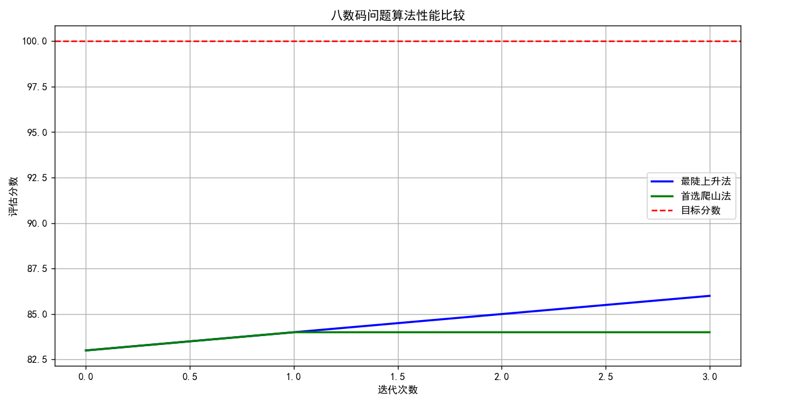
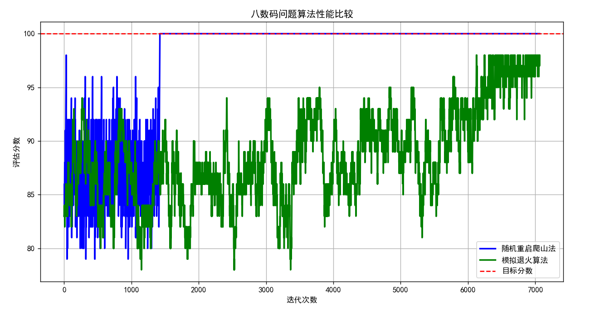
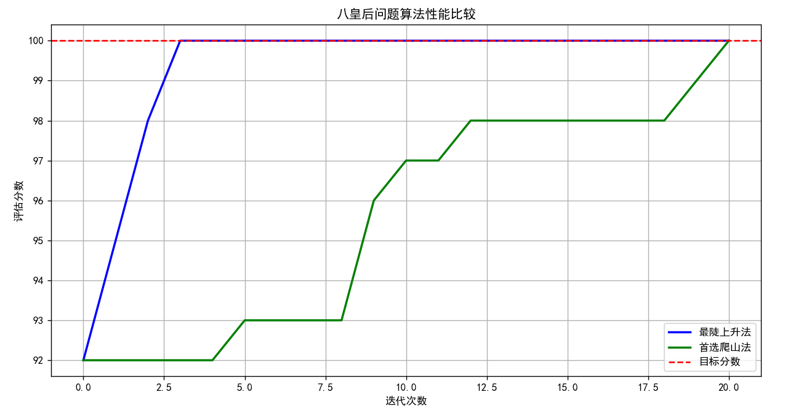
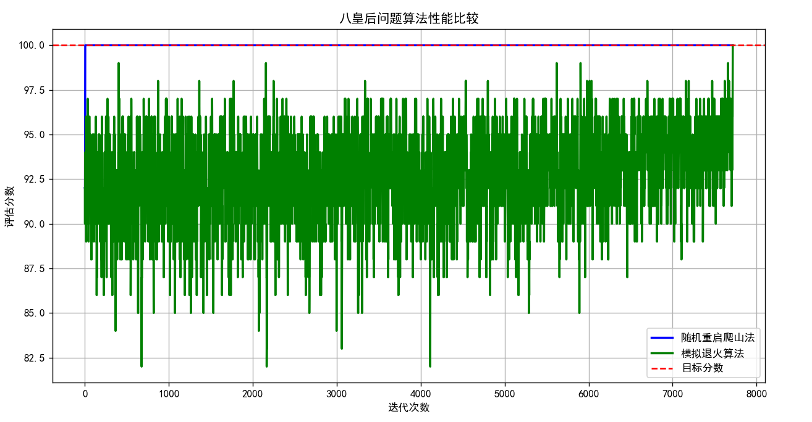

# 局部搜索算法和最优化问题

## 八数码问题

```python
python eightpuzzle.py

# 生成八数码问题的随机初始状态
生成的八数码状态：
6 3 7
8 2 4
5 1 0

可能的移动方向： ['上', '左']
```

## 八皇后问题

```python
python eightqueens.py

# 生成八皇后问题的随机初始状态
随机生成的八皇后状态：
Q . . . . . . .
. Q . . . . . .
. . . . . Q . .
. . . . . . . Q
. . . . . . Q .
. Q . . . . . .
. . . . . Q . .
. . . Q . . . .

皇后位置：{(6, 5), (0, 0), (3, 7), (1, 1), (4, 6), (5, 1), (7, 3), (2, 5)}

在指定位置放置皇后：
Q . . . . . . .
. . Q . . . . .
. . . . Q . . .
. . . . . . . .
. . . . . . . .
. . . . . . . .
. . . . . . . .
. . . . . . . .

测试(3,1)位置是否有效： True
测试(0,2)位置是否有效： False
```

## 算法实现

- 爬山算法
  - 最陡上升爬山法
  1. 从当前状态开始，生成所有可能的邻居状态
  2. 评估所有邻居状态，选择评估值最高的邻居作为下一个状态
  3. 如果最佳邻居的评估值不比当前状态好，或者达到目标状态，则算法停止
  4. 否则，将最佳邻居状态作为当前状态，重复步骤1-3
  - 首选爬山法
  1. 从当前状态开始，随机生成所有可能的邻居状态
  2. 检查邻居状态，找到第一个比当前状态更好或者相同评估函数值解就立即采用
  3. 重复步骤1-2直到找不到更好的解或达到最大迭代次数
- 模拟退火算法

## 八数码问题说明与示例图





## 八皇后问题说明与示例图




